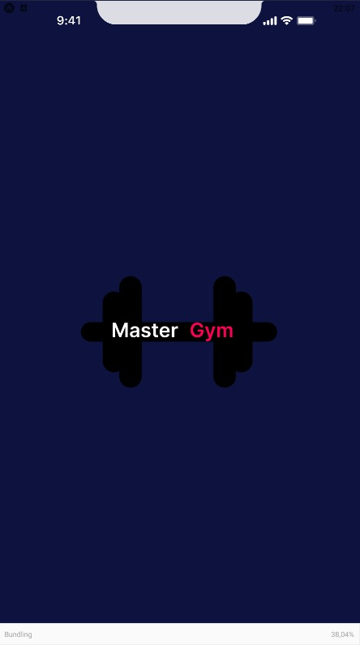
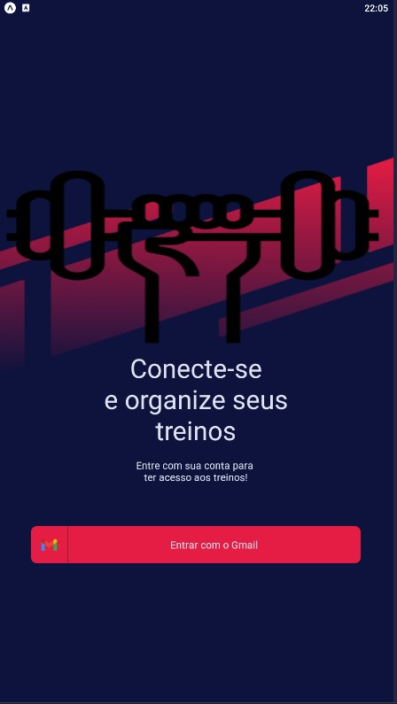

# 🏋️ Master Gym

Aplicativo de academia desenvolvido com [NodeJs](https://nodejs.org/en/) e [React-Native](https://reactnative.dev/).

## 👥 Integrantes

Bruno Cesar de Almeida Ribeiro 210570 CP110TIN2 PA038TIN3 <br>
Kaetano Cesar Apolinario Rodrigues 190157 CP110TIN3 PA038TIN1 <br>
Jhonatan José Gomes do Amaral 190932 CP110TIN1 PA038TIN1 <br>
Lucas Henrique Zocca Soares 190907 CP110TIN3 PA038TIN3 <br>
Yan Abe Rosa 190111 CP110TIN3 PA038TIN1 <br>

## 🚀 Funcionalidades

Aplicativo para organizar seus treinos. Criar grupos para treinar com seus amigos. Agendar treinos. Visualizar suas aulas e seus treinos agendados.

## ⚙️ Como utilizar

Utilize o **yarn** ou o **npm install** para instalar as dependências do projeto.
Em seguida, inicie o projeto com o comando abaixo.

```cl
expo start
```

O projeto poderá ser visualizado através do QR Code pelo celular, ou, através da função "Run in web browser" localmente.

## 📱 Telas do projeto

### Tela de início <br><br>



### Tela de login <br><br>


